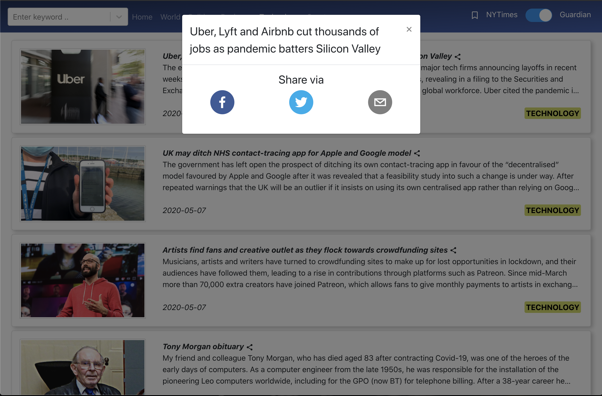
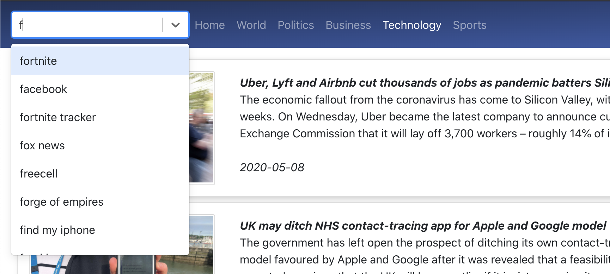

## Dev
`npm install`

`cd node_backend`

`npm install`

`npm start`

`cd .. && npm start`

## Prod (Serve static files from node server)

`npm build`

`cd node_backend && npm start`

## Notes
Comment box and Auto suggestions might not work if you do not do the following steps

`mkdir src/Data.js` file with your API keys, according to example given in `src/Data_Ex.js`

# Screenshots

<table>
<tr>
    <td>
        
    </td>
    <td>
        
    </td>
</tr>
<tr>
    <td>
        
    </td>
    <td>
        
    </td>
</tr>
<tr>
    <td>
        
    </td>
    <td>
        
    </td>
</tr>
<tr>
    <td>
        
    </td>
    <td>
        
    </td>
</tr>

</table>